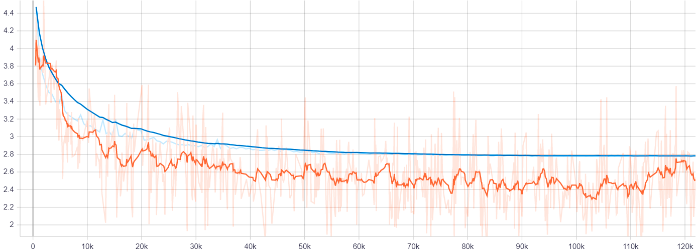

# 2D RetinaNet for Prostate Localization in mpMRI
 
**Problem Statement**: Localization of the prostate (healthy or with benign/malignant tumors) in multi-parametric MRI scans (T2W, DWI *with high b-value*, ADC).   

**Data** (*proprietary to Radboud University Medical Center*): 1950 prostate mpMRI volumes (*Healthy/Benign Cases*: 1234; *Malignant Cases*: 716); equivalent to 23400 2D slices. [1559/391: Train/Val Ratio]

**Acknowledgments**: The following approach is based on a TensorFlow Estimator/Keras (v1.15) adaptation of [keras-retinanet](https://github.com/fizyr/keras-retinanet/) by Fizyr, [SEResNet](https://github.com/qubvel/classification_models) by Pavel Yakubovskiy et al., and an [anchor optimization algorithm](https://github.com/martinzlocha/anchor-optimization) by Martin Zlocha et al.

**Note**: The following project is a simplified precursor leading up to the goal of computer-aided clinically significant prostate cancer detection in mpMRI scans, using deep neural network detection models.

**Directories**  
  ● Preprocess Dataset to Normalized Volumes in Optimized NumPy Format: `scripts/preprocess.py`  
  ● Generate Data-Directory Feeder List: `scripts/feeder_csv.py`  
  ● Anchor Optimization: `misc/rdc_08.py`  
  ● Pre-Calculate Regression Target Deltas *(to determine Mean, STDEV): `misc/rdc_07.py`  
  ● Train 2D RetinaNet Model: `scripts/train_RetinaNet.py`  
  ● Deploy Model (Validation): `scripts/deploy_model.py`  
  

**Reference Publications:**  
  ● Tsung-Yi Lin et al. (2017), "Focal Loss for Dense Object Detection", IEEE ICCV. DOI:10.1109/ICCV.2017.324  
  ● M. Zlocha et al. (2019), "Improving RetinaNet for CT Lesion Detection with Dense Masks from Weak RECIST Labels", MICCAI. DOI:10.1007/978-3-030-32226-7_45                 

## Train/Validation 
  
  
*Figure 1.  Training (orange) and validation (blue) loss [focal+L1] curves for the 2D RetinaNet using an exponentially decaying learning rate of 1e-4 with 80% decay every 5 epochs, optimized by SGD with momentum of 0.9.*  
  
    
    
## Inference  
  
  
*Figure 2.  Predicted prostate bounding boxes at different scales and orientations [in green] by the 2D RetinaNet, versus the segmentation ground-truth [in blue] (converted to bounding box annotation at train-time) on T2W MRI slices.* 
